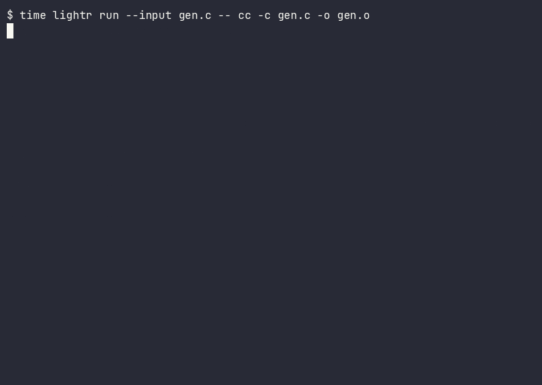

# Lightr

> **So light it isn't there.** A daemonless, imageless container runtime
> with a memory: workspaces materialize from a content-addressed store,
> runs are memoized — identical work never executes twice.



```sh
$ lightr run --input src -- make test     # 1st: does the work
$ lightr run --input src -- make test     # 2nd: memo HIT — replays, no execution
$ pgrep lightr                            # nothing. it isn't there.
```

## Measured, not promised

Every number below was measured on named hardware with a public method and
a reproduce path. Absent competitors print SKIP — never a fabricated number.

| | Lightr | vs | Factor | Evidence |
|---|---|---|---|---|
| Cold start, full rootless isolation (`ns --net=none`) | **30.8 ms** | podman 124.9 ms | **4.05×** | GitHub-hosted Linux CI, n=100, 2026-06-25 — «CI run link» · [method](docs/benchmarks/RESULTS.md) |
| Re-build, nothing changed (memoized) | **10.3 ms** | 20,633 ms | **~2,000×** | same CI job, n=10 — «CI run link» |
| Container re-run (memo, **no VM boot**) | **14 ms** | docker ~1.3 s | **93×, unbounded** | Intel Mac, docker 28.3.2, median of 3, 2026-06-18 · [ledger](docs/spec/benchmark-results.md) — «demo gif» |
| Materialize 1 GB (CoW) | **322 ms** | docker 38.4 s | **119×** | Intel Mac, same run header — «demo gif» |
| Install footprint | **4.3 MB** | Docker.app 1,962 MB | **452×** | deterministic; check the release asset |
| Idle resident processes | **0** | 8 | **∞** | anywhere; `pgrep` proves it |
| K8s CRI resident footprint | **7.1 MB** | containerd 65.9 MB | **9.32×**, no per-container shim | Linux CI, 2026-06-26 — «CI run link» |

Run the table yourself: `lightr bench-compare --vs docker`

Evidence rule (also the repo's law): Linux rows link a **public CI run**;
Intel-Mac rows are the median of 3 back-to-back runs on named hardware,
with a one-command reproduce path. Anything unmeasured is stated as a
target, never as a number.

## Honest status (read this first)

> **Validated** (test/bench-backed): the whole local core —
> content-addressed store, memoized `run`/`build`, OCI import
> (sha256-verified), time-axis (`undo`/`diff`/`bisect`), lazy compose,
> docker compat, and the agent/MCP surface — **411 tests, 0 failures** at
> go-live (2026-06-17). The **`ns` engine (Linux) is runtime-validated on
> public GitHub-hosted CI** (cold-start benchmark + network-namespace
> isolation proof). The **`vz` engine (macOS microVM) is validated
> end-to-end on Intel x86_64 only** — real Alpine boots, real guest exit
> codes.
>
> **Not yet validated / not built:** arm64 `vz` is press-go via a runbook,
> not validated. The Windows `wsl` engine is code-complete but
> hardware-gated. The `fc` (Firecracker) engine is not built. The O(1)
> "views" backends are a staged perf optimization (honest `Unsupported`) —
> what ships is **CoW hydrate**, real and tested. Rootless `ns` is **not**
> a hostile-tenant boundary. Feature-by-feature reality:
> [the truth ledger](docs/spec/parity-audit.md).

## Why

Docker is three products glued together — distribution (images, layers,
registries), isolation, and a 24/7 daemon. Lightr unbundles them: one
content-addressed plane (a **ref** for any tree of bytes), isolation à la
carte (native / namespaces / microVM), no resident process, and an action
cache so the cheapest run is the one that never happens. The store speaks
the same content-addressed model as CoreLink, the sync fabric it can later
attach to — but everything here is local-first, offline, and account-free.

```
lightr CLI ──> store (CAS + Action Cache) ──> engines
  one binary     refs · chunks · memo          native | ns | vz
  no daemon      CoW materialize               (wsl, fc staged)
```

## Quickstart (30 seconds)

```sh
$ brew install humanguardrail/tap/lightr    # or: cargo build --release (bin ~5.9 MB, measured 2026-07-02)
$ lightr snapshot --dir . --name @me/proj
$ lightr hydrate /tmp/fresh --name @me/proj    # CoW materialize
$ lightr run --input src -- make test          # run it twice.
$ lightr oci import alpine.tar --name @docker/alpine
$ lightr run --engine vz --rootfs @docker/alpine -- sh -c 'exit 7'  # → 7
```

The last line boots a real Linux microVM on Intel macOS (`--features vz`)
and returns the guest's real exit code. Nothing runs between invocations.
The local verbs touch no network; only `oci pull` reaches a registry.

## For agents

`--json` on every verb (schema'd: `lightr schema`) · `--explain` (memo
keys, CoW rung, what a run read) · `--events` ndjson · `plan` dry-run ·
**`lightr mcp`** — the runtime is an MCP server.

## Security model (read this)

`native` is reproducibility, **not a sandbox** — and says so loudly.
Rootless `ns` is not a hostile-tenant boundary. Hostile tenancy needs
hardware isolation (`vz` today, Intel-validated; `fc` staged). Fail-closed
everywhere: unsupported paths error, they don't silently degrade.

## Deep dives

- [The three killers](docs/killer-features.md) — memo, daemonless, imageless
- [Truth ledger](docs/spec/parity-audit.md) — feature-by-feature reality,
  including the audits that reversed our own claims
- [Benchmarks](docs/benchmarks/RESULTS.md) (Linux CI) ·
  [macOS head-to-head](docs/spec/benchmark-results.md) ·
  [ADRs](docs/adr/) · [Architecture](docs/ARCHITECTURE.md)
- [How this was built](docs/METHOD.md) — ADR gates, agent
  fleet in worktrees, adversarial audits, the truth ledger
- [Docs map](docs/README.md) — reviewer's reading order

---

Apache-2.0 · github.com/HumanGuardrail/hugr-lightr · Numbers carry their measurement dates above —
refresh at publication.
